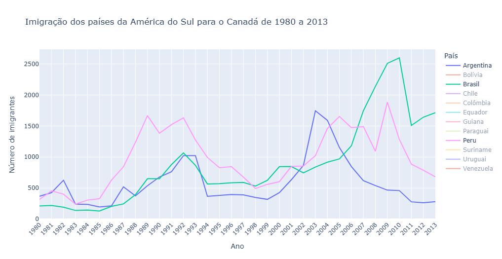

Visualização de Dados: Imigração para o Canadá 🇨🇦
Este projeto analisa o fluxo migratório de países da América do Sul para o Canadá, utilizando Python e bibliotecas de visualização de dados para transformar números brutos em insights compreensíveis e interativos.

📋 Sobre o Projeto
O objetivo principal é explorar o conjunto de dados de imigração do Canadá, filtrando as tendências migratórias de países sul-americanos ao longo das décadas. O projeto utiliza o Plotly para gerar gráficos interativos que permitem uma exploração detalhada dos dados.

🛠️ Tecnologias Utilizadas
Python 3.x
Pandas: Para manipulação e limpeza de dados.
Plotly: Para criação de gráficos dinâmicos e interativos.
Jupyter Notebook: Ambiente de desenvolvimento.

📊 Funcionalidades
Processamento de Dados: Limpeza e organização de datasets complexos.
Análise Temporal: Visualização da evolução da imigração ao longo dos anos.
Gráficos Interativos: Criação de gráficos de linhas e áreas que permitem zoom e detalhes ao passar o mouse.
Exportação: Geração de arquivos HTML autônomos para compartilhamento das visualizações.

🚀 Como Executar
Clone este repositório

Instale as dependências necessárias:
Bash
pip install pandas plotly
Certifique-se de ter o arquivo de dados imigrantes_canada.csv no diretório correto.
Abra o arquivo DataVisualization1.ipynb em seu Jupyter Notebook ou Google Colab e execute as células.

